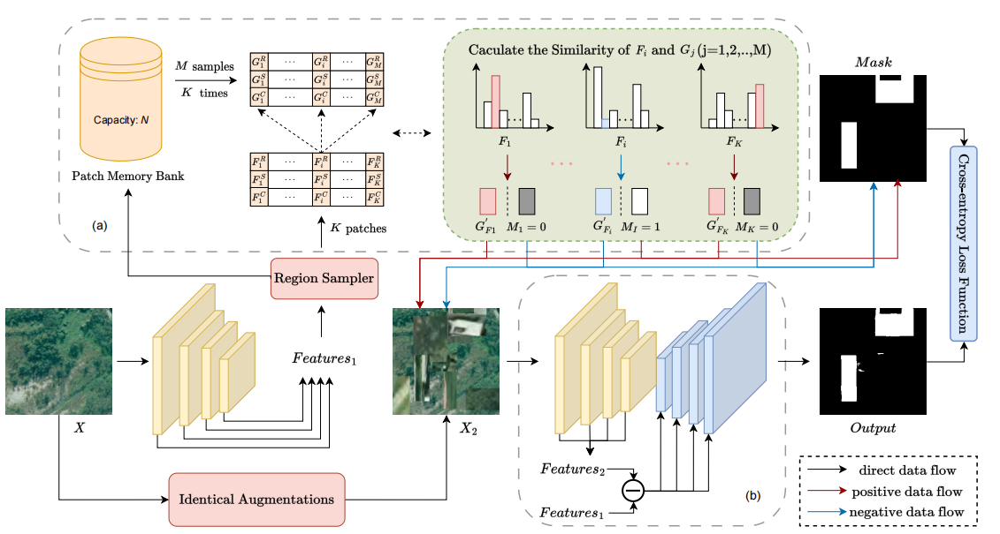

# S3FCD
The code for "S3FCD: Single-temporal image change detection; self-supervised learning; change generation; pixel-level representation; deep learning; remote sensing".

<p align="center">
  
</p>

## Project Structure

```
S3FCD/
├── train.py              # Training script (single/multi-GPU)
├── val.py                # Validation script
├── infer.py              # Inference script
├── model/                # Model architectures
│   ├── snunet.py
│   ├── changeformer.py
│   ├── bit_cd.py
│   ├── siamese_unet_conc.py
│   └── siamese_unet_diff.py
├── dataset/              # Dataset loaders
│   ├── common.py         # General-purpose dataset class
│   ├── sysu.py           # SYSU-CD dataset
│   └── dmb.py            # DMB dataset
├── build/                # Factory functions
│   ├── model.py
│   ├── dataset.py
│   ├── loss.py
│   ├── optimizer.py
│   └── lr_scheduler.py
├── loss/                 # Loss functions
├── utils/                # Utilities (metrics, EMA, visualization)
├── config/               # Configuration via YACS
├── tools/                # Auxiliary scripts and notebooks
├── doc/                  # Documentation
├── Makefile              # Common commands
└── requirements.txt
```

## Installation

```bash
# Clone the repository
git clone <repo-url> && cd S3FCD

# Install dependencies
pip install -r requirements.txt

# Or use Makefile
make env

# Initialize working directories
make init
```

### Requirements

- Python >= 3.8
- PyTorch >= 1.10
- CUDA (recommended for training)
- Additional dependencies: `thop`, `albumentations`, `change_detection_pytorch`, `loguru`, `einops`, `imgaug`

## Usage

### Training

**Single GPU (debug):**

```bash
python train.py -bs 4 -nw 2 -pp 10 -ne 30 -lr 1e-3 -wd ./work_dirs/train/
```

**Multi-GPU (DDP):**

```bash
python -m torch.distributed.launch --nproc_per_node=2 --master_port=23456 \
    train.py -bs 10 -nw 4 -pp 10 -ne 25 -lr 5e-4 -ft 0.4 -pv 20 \
    -wd ./work_dirs/train/
```

**Key arguments:**

| Argument | Description | Default |
|----------|-------------|---------|
| `-bs` | Batch size per GPU | 16 |
| `-lr` | Learning rate | 1e-3 |
| `-ne/--epochs` | Number of epochs | 30 |
| `-pv/--period_val` | Validation frequency (batches) | 1 |
| `-pp/--period_print` | Print frequency (batches) | 10 |
| `-wd/--work_dir` | Output directory | `../work_dirs/` |
| `--ema` | Enable EMA | False |
| `-de/--decay_ema` | EMA decay factor | 0.99 |
| `-ft/--f1_thr` | F1 threshold for saving checkpoints | 0.68 |

### Validation

```bash
python val.py \
    -ccp /path/to/checkpoint.pth \
    -sd ./work_dirs/val/ \
    -f 255 -ts
```

### Inference

```bash
python infer.py \
    -ccp /path/to/checkpoint.pth \
    -sd ./work_dirs/infer/ \
    -f 255 -ts
```

| Argument | Description |
|----------|-------------|
| `-ccp` | Path to model checkpoint |
| `-sd` | Directory to save output images |
| `-f/--factor` | Pixel value multiplier for saved masks |
| `-ts/--together-show` | Save input images and predictions side by side |

## Supported Models

| Model | Source | Reference |
|-------|--------|-----------|
| UNet++ | `change_detection_pytorch` | Zhou et al. |
| SNUNet | Custom | Fang et al. |
| BIT | Custom | Chen et al. |
| ChangeFormer | Custom | Bandara & Patel |
| Siamese-UNet (Conc/Diff) | Custom | Daudt et al. |

## Dataset Format

The `CommonDataset` class expects a metafile with the following format:

```
image_000_a.jpg image_000_b.jpg gt_000.png
image_001_a.jpg image_001_b.jpg gt_001.png
...
```

Each line contains space-separated paths (relative to `data_root`) for: pre-change image, post-change image, and ground truth mask.

## Evaluation Metrics

- **F1 Score** — harmonic mean of precision and recall
- **IoU** (Intersection over Union)
- **Precision / Recall**
- **OA** (Overall Accuracy)
- **Kappa** coefficient

## Citation

If you find our work useful, please consider cite our paper :)


```bibtex
@article{Lv02112025,
author = {Wenqian Lv and Nian Shi and Keming Chen and Guangyao Zhou and Chunlei Huo},
title = {S3FCD: a single-temporal self-supervised learning framework for remote sensing image change detection},
journal = {Geo-spatial Information Science},
volume = {28},
number = {6},
pages = {2822--2843},
year = {2025},
publisher = {Taylor \& Francis},
doi = {10.1080/10095020.2025.2480816}
URL = {https://doi.org/10.1080/10095020.2025.2480816},
eprint = {https://doi.org/10.1080/10095020.2025.2480816}}

```

